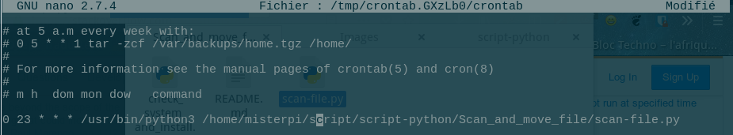

Scan and move
--
this script allows you to scan your download folder with clamav antivirus and move the files to their respective folders (it sorts) the image files (.jpg,.png) it moves them to the Images folder the music files it moves them to the Music folder and so on

how to use this
--
#### You need python 3

1 - Download git project

		git clone https://github.com/Diallomm/Scan_and_move
		cd Scan_and_move

2 - Execute "check_system_and_install.py" with python3

		 python3 check_system_and_install.py

* he check if you have the good softwares (clamav and tkinter) and make the Folders for future files

3- you can add Scan-file.py in your crontab  execute every day at 23H (or another time, __it's up to you to choose the frequency__ )

		crontab -e

add this

		0 23 * * * /usr/bin/python3 "directory where is a script"

exemple:

### last
save and exit , Normally of is Good
